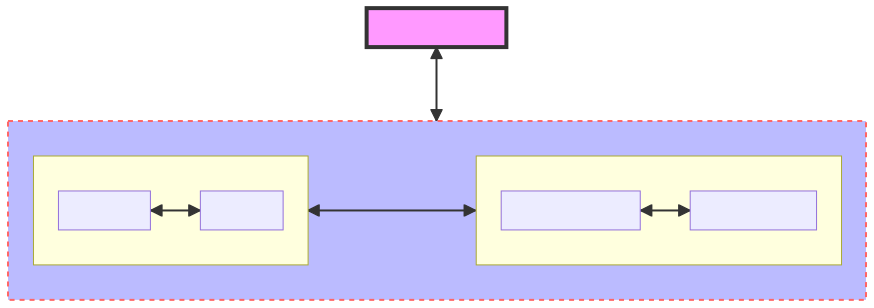

# Solana Layer2 node

A Solana based Layer 2 node. 

## Building

For how to build and test code, see [solana](https://github.com/solana-labs/solana/blob/master/README.md)'s succinct instructions.

### Design

The architecture of design as below:



There are two roles in our Layer 2: __Execution Layer__ and __Settlement Layer__.

* Execution Layer contains:
  
  * Execution Node
    
    Handles all Layer 2 transactions, produce block, push block to DA. 
  
  * Verification Node:
    
    Pull data from DA, reconstruct block and replay.

* Settlement Layer contains:
  
  * Full node:
    
    Check the challenge and push transaction data to DA.
  
  * Light node:
    
    Sync header data.

## Progress

### 1. Execution Layer

```mermaid
graph TD
    A[Execution Node] --> |push block| B[DA]
    B --> |replay data| C[Verification Node]
```

   For now, since Celestia is still unstable, we use PostgreSQL as a DA simulator, here is the execution flow:

#### Execution flow of Execution Layer

##### 1.1 Execution Node

* The execution node produce blocks, we use [accountsdb-plugin-postgres](./solana-accountsdb-plugin-postgres) to save blocks into PostgreSQL database.
  
  Instructions:
  
  a. Build code with submdoule
    
    ```
    git clone https://github.com/Eclipse-Laboratories-Inc/settlement.git
    cd settlement
    cargo build --release
    ```
  
  b. Setup database
    
    &emsp;&emsp;For detailed documents of how to setup database, see [here](./solana-accountsdb-plugin-postgres#database-setup) .
    
    &emsp;&emsp;Suppose we got a database named `solana`, a username `solana` with password `1234`. 
    
    &emsp;&emsp;Then we should create Schema Objects in our solana  database. Our current directory is still `solana-executor`, so here is the command:
    
    ```
    psql -U solana -p 5432 -h localhost -d solana -f solana-accountsdb-plugin-postgres/scripts/create_schema.sql
    ```
    
    &emsp;&emsp;Let's explain the parameters in above command:
    
    ```
    -U -- username
    -p -- port of PostgreSQL server
    -h -- ip address pf PostgreSQL server
    -d -- database name
    -f -- the path of SQL script file we want to execute
    ```
  
  c. Configure plugin settings
    
    &emsp;The plugin configure file is `solana-accountsdb-plugin-postgres/scripts/geyser.json`, we need change some settings in it:
    
    ```json
    {
      "libpath": "../../target/release/libsolana_geyser_plugin_postgres.dylib",
      "host": "127.0.0.1",
      "user": "solana",
      "password": "1234",
      "dbname": "solana",
      "port": 5432,
      "threads": 20,
      "batch_size": 20,
      "panic_on_db_errors": true,
      "accounts_selector" : {
          "accounts" : ["*"]
      },
      "transaction_selector" : {
          "mentions" : ["*"]
      },
      "entry_selector" : true
    }
    ```
    
    &emsp;The configuration details are:
    ```
    libpath -- Our `libsolana_geyser_plugin_postgres` lib, should be in `target/release/libsolana_geyser_plugin_postgres.dylib
    host -- PostgreSQL server ip address
    user -- Username of database
    password -- Paddword of database
    dbname -- Database name
    port -- Port of PostgreSQL server, in our case, 5432.
    ```
  
  d. Start execution node
    
    &emsp;For now, we use Test Validator as our execution node, we start it with plugin configure file we just set.
    
    ```shell
    ./target/release/solana-test-validator --geyser-plugin-config ./solana-accountsdb-plugin-postgres/scripts/geyser.json
    ```
    
    &emsp;Now our test validator start producing blocks, and all these data saved in PostgreSQL.

##### 1.2 Verification Node

* Start verification node

&emsp;&emsp;Prerequisites:

```
* Configuration file of geyser plugin.
* 'genesis.bin' directory path, we need to obtain 'genesis.bin' from execution node's ledger directory, and store it in verification node file system.
```

&emsp;&emsp;Replay and verify shred from PG.

```shell
./target/release/shred-replay -c ./solana-accountsdb-plugin-postgres/scripts/geyser.json -l replay-ledger -g genesis_path
```

&emsp;&emsp;The command means:
```
-c, --config <CONFIG>           Configuration file to use [default: config.json]
-g, --genesis <GENESIS_PATH>    Use GENESIS_PATH as genesis path [default: ledger]
-l, --ledger <DIR>              Use DIR as ledger location [default: ledger]
```

* Start verification node's RPC service

```shell
./target/release/solo_rpc -l replay-ledger
```

&emsp;&emsp;`-l` means the verified ledger of verification node.

### 2. Settlement Layer

    TBD


## Designs of under the hood

#### Core designs of Execution Layer

  For Execution Node: 
  * Adding a `entry_notifier` related functions in `geyser-plugin`, which is used for writing entries into PG when validator actives.

  For Verification Node: 
  * `shred-replay-service` querys entries from PG, converts them to shreds, inserts into `blockstore`.
  *  Use `solana-ledger-tool`'s verify function, generating bank hash for whole blockstore.
  


# 编译

不要使用 brew 安装 rust, 如果已经使用 brew 安装了 rust，需要先卸载 rust
```
$ brew uninstall rust 
```

使用下述命令安装 rust

``` 
$ curl --proto '=https' --tlsv1.2 -sSf https://sh.rustup.rs | sh
$ source $HOME/.cargo/env
```

安装完成后的路径

``` 
$ which rustup
$HOME/.cargo/bin/rustup

$ which rustc
$HOME/.cargo/bin/rustc
```

使用命令查看当前工具链 以及支持的所有工具链


```
$ rustup show
$ rustup target list
$ rustup toolchain list
```

常用的如下

```
使用 apple m1 m2 芯片 的 macos
aarch64-apple-darwin

使用 intel 芯片 的 macos
x86_64-apple-darwin 
```

添加相应工具链并删除不用的工具链
``` 
此处仅为举例。需要根据实际情况确定编译工具链和编译目标。
$ rustup target add aarch64-apple-darwin
$ rustup toolchain install stable-aarch64-apple-darwin
$ rustup target remove x86_64-apple-darwin
$ rustup toolchain uninstall stable-x86_64-apple-darwin 1.67.1-x86_64-apple-darwin
```

设置编译工具链

```
此处仅为举例。需要根据实际情况确定编译工具链。
$ rustup default stable-aarch64-apple-darwin 
```

设置编译平台

```
$ vim $HOME/.cargo/config

此处仅为举例。需要根据实际情况确定编译目标。

添加

[build]
target = "aarch64-apple-darwin"
```

也可以在编译时指定

``` 
此处仅为举例。需要根据实际情况确定编译目标。

$ cargo build --release --target aarch64-apple-darwin
```
